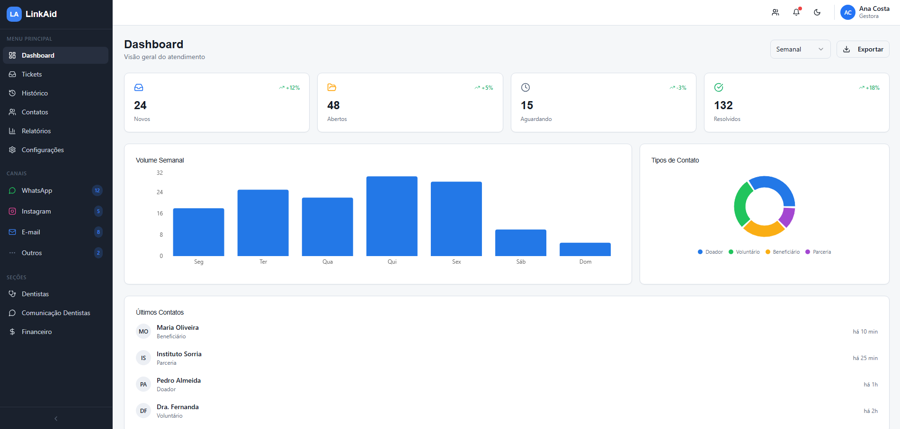
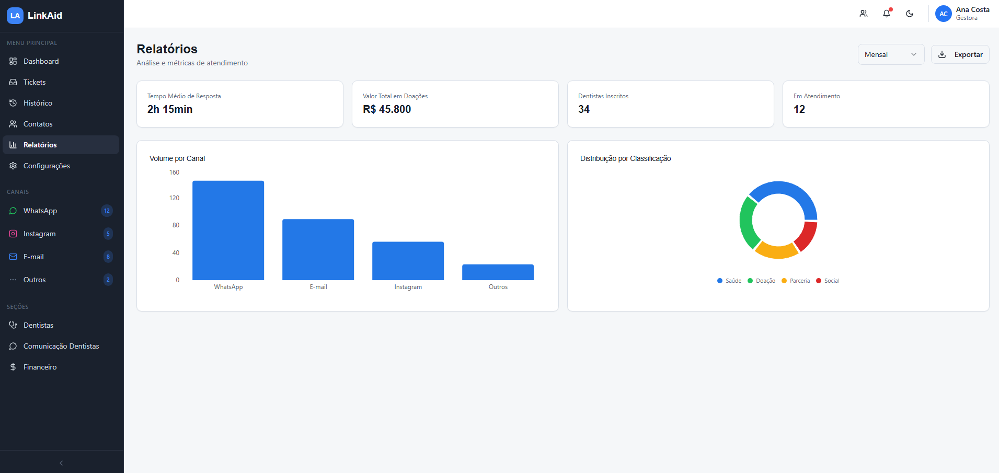
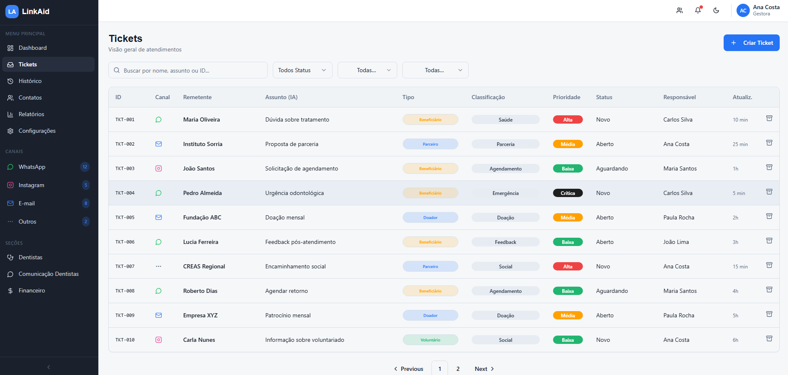
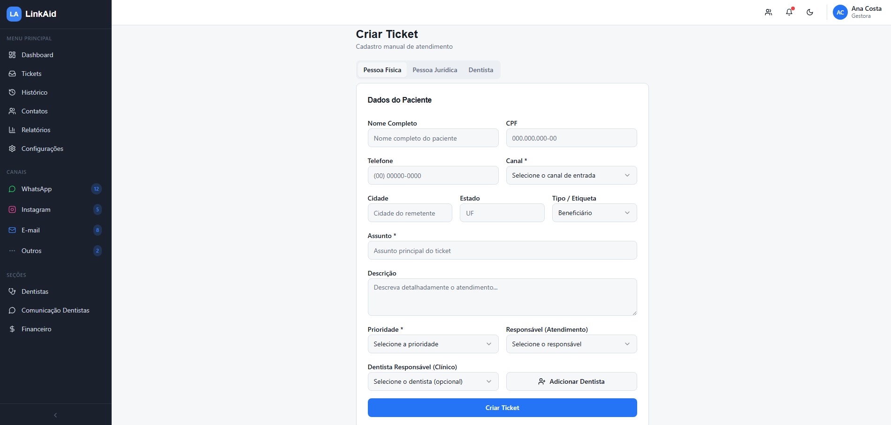
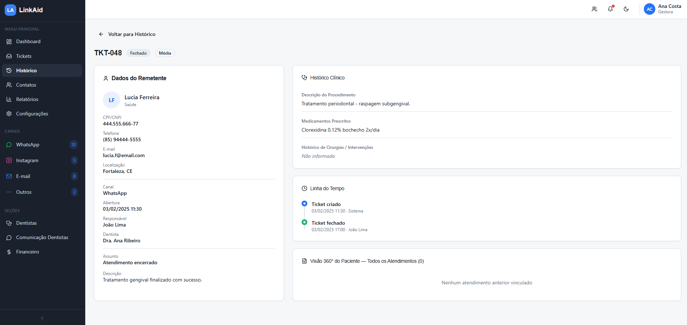
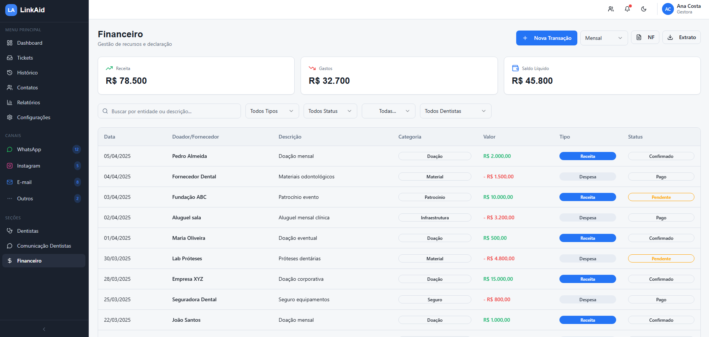

<div align="center">
<br>
   
## Plataforma de Atendimento Inteligente e Humanizada  
Centralize, automatize e escale o atendimento sem perder o toque humano.

[](#)

🔗 **Acesse o repositório:**  
👉 https://github.com/Calegor/LinkAid

<!-- 🔗 **Acesse o vídeo:**  
👉 https:// !-->
  
<br>

  

</div>

<br/>

---

<br/>

## 💡 Sobre o Projeto

O **LinkAid** é uma plataforma de **atendimento inteligente e humanizado**, projetada para centralizar, organizar e otimizar a comunicação entre organizações e seus públicos.

Em cenários com múltiplos canais de contato (como e-mail, WhatsApp, Instagram e formulários), é comum enfrentar:

- ❌ Perda de mensagens importantes  
- ⏳ Demora no atendimento  
- ⚠️ Sobrecarga operacional com triagens manuais  

O LinkAid resolve esse problema ao transformar todas as interações em um **fluxo estruturado e rastreável**, através de um sistema de **ticketing inteligente com automação de processos**.

> 💡 Embora possa ser aplicado em contextos como ONGs (ex: gestão de doadores, voluntários e beneficiários), o LinkAid foi concebido como uma solução **flexível**, capaz de atender diferentes tipos de organizações que lidam com alto volume de comunicação.

<br/>

## 🎯 Proposta do Projeto

O objetivo do LinkAid é unir:

- 🤖 **Eficiência tecnológica** (automação, IA, organização de dados)  
- ❤️ **Cuidado humano** (atendimento empático e personalizado)  

Criando um modelo de atendimento **híbrido, escalável e estratégico**.

<br/>

## ✨ Funcionalidades Principais

| Funcionalidade | Descrição |
| :--- | :--- |
| 📊 Dashboard Centralizado | Visualização em tempo real de todas as interações |
| 🎫 Ticketing Inteligente | Criação automática de tickets com histórico |
| ⚙️ Automação de Fluxos | Regras inteligentes de triagem e encaminhamento |
| 👥 Base de Contatos | Histórico completo de usuários |
| 📈 Relatórios e Insights | Métricas estratégicas de atendimento |
| 🧠 Classificação com IA | Identificação automática de tipo de usuário e intenção da mensagem |
| 🔔 Notificações em Tempo Real | Alertas sobre novos tickets e atualizações importantes |
| 🏷️ Gestão de Status e Prioridade | Organização de atendimentos por nível de urgência |
| 🔍 Filtros e Busca Avançada | Localização rápida de tickets e contatos |
| 📜 Histórico Completo de Atendimentos | Rastreamento detalhado de todas as interações |
| 🔗 Integração com Múltiplos Canais | Centralização de mensagens de diferentes plataformas |
| 👤 Atribuição de Responsáveis | Distribuição automática ou manual de tickets entre usuários |
| 📱 Interface Responsiva | Acesso completo via desktop e dispositivos móveis |
| 💰 Módulo Financeiro | Gestão de dados financeiros relacionados aos atendimentos |
| 📎 Registro de Informações Adicionais | Inclusão de observações e dados complementares nos tickets |

<br/>

## 🚀 Conheça o LinkAid

<table>
<tr>
<td width="50%">

### 📊 Relatórios  
Visualize métricas e dados de atendimentos para monitoramento e melhoria contínua.

</td>
<td width="50%">

</td>
</tr>

<tr>
<td width="50%">

</td>
<td width="50%">

### 🎫 Gestão de Tickets  
Gerencie atendimentos com status, responsáveis e histórico completo.

</td>
</tr>

<tr>
<td width="50%">

### ➕ Criação de Tickets  
Registre novas solicitações de forma rápida e estruturada.

</td>
<td width="50%">

</td>
</tr>

<tr>
<td width="50%">

</td>
<td width="50%">

### 📜 Histórico Completo  
Acompanhe todo o ciclo de atendimento com rastreabilidade total.

</td>
</tr>

<tr>
<td width="50%">

### 💰 Módulo Financeiro  
Controle financeiro integrado à plataforma.

</td>
<td width="50%">

</td>
</tr>

</table>

<!-- <br/>

// Nota Ju Guimarães: esse texto ainda não está mostrando, é um comentário. Eu fiz um texto aleatório para demonstrar sobre o nosso sistema, mas eu preciso que
vocês escrevam certinho cada passo. É pro nosso readme ficar mais completo e profissional.

 ## ⚙️ Como o Sistema Funciona

O LinkAid foi projetado como uma arquitetura modular, onde cada componente possui uma responsabilidade específica dentro do fluxo de atendimento.

### 🔄 Fluxo Geral

1. 📩 **Entrada de Dados**  
   As mensagens chegam por diferentes canais (ex: formulários, e-mail e integrações externas).

2. 🧠 **Processamento Inteligente (Python + IA)**   // THIAGO
   O backend em Python analisa o conteúdo utilizando técnicas de NLP para:
   - identificar a intenção  
   - classificar o tipo de usuário  
   - sugerir direcionamentos  

3. ☕ Orquestração e Regras de Negócio (Java)     // THIAGO
   A camada Java:
   - registra doações  
   - cria e gerencia tickets  
   - define prioridades e responsáveis

4. 🎫 **Sistema de Ticketing**  <- NÃO IMPLEMENTADO ESSA SPRINT
   Cada interação se torna um ticket com:
   - status  
   - histórico  
   - rastreabilidade  

5. 🎨 **Interface do Usuário (Frontend)**   // JU GUIMARAES
   Permite:
   - visualizar tickets  
   - responder solicitações  
   - acompanhar métricas
   - criar tickets manualmente
   - visualizar cadastros

6. 🗄️ **Persistência de Dados (Database)**   // JU SPANOPOULOS
   Garante:
   - armazenamento seguro  
   - histórico completo  
   - suporte a relatórios 

---

### 🧩 Integração entre os Módulos <- NÃO IMPLEMENTADO ESSA SPRINT

- Frontend → Java API  
- Java → Python (IA)  
- Java → Database  
- Python → Java  

> Arquitetura modular que permite escalabilidade e manutenção independente.

---

### 🚀 Por que essa arquitetura?

- 🔹 Escalável  
- 🔹 Flexível  
- 🔹 Inteligente  
- 🔹 Organizada  

> O LinkAid é uma plataforma pensada para evolução contínua. !-->

<br/>

## 🌍 Exemplos de Aplicação

O LinkAid pode ser utilizado em diversos contextos:

- 🏥 ONGs e projetos sociais  
- 🏢 Empresas com atendimento ao cliente  
- 🎓 Instituições educacionais  
- 📞 Centrais de suporte  

<br/>

## 🌉 O Significado do Nome

**LinkAid = Link + Aid**

- **Link:** conexão entre pessoas, demandas e soluções  
- **Aid:** ajuda, assistência  

> Uma ponte inteligente entre quem precisa e quem pode ajudar.

<!-- <br/>

// Nota Ju Guimarães: preciso que cada um de vocês escreva, seguindo esse modelo, sobre o conteúdo das pastas

## 🏗️ Estrutura do Projeto

```
LinkAid/
├── front-end/        # React + TypeScript + TailwindCSS
├── java/             # Criação e gereciamento de tickets (JDBC)
├── python/           # CRUD de pessoas (OracleDB), ***Processamento e IA (FastAPI)*** < - Acho melhor colocar na pasta de chatbot
├── database/         # Modelagem e scripts SQL
├── business-model/   # Documentação e diagramas
└── ia-chatbot/       # Análise exploratória de dados
``` !-->

<br/>

## 🛠️ Tecnologias Utilizadas

### 🎨 Frontend
- VITE
- React  
- TypeScript  
- TailwindCSS
- Visual Studio Code

<!--

// Nota Ju Guimarães: preciso que cada um de vocês escreva, seguindo esse modelo, sobre as tecnologias utilizadas

### ☕ Backend (Java)
- Java 17+  
- Maven  

### 🐍 Backend (Python)
- FastAPI (SE FOR IMPLEMENTADO EM IA) 
- OracleDB

### 🗄️ Banco de Dados
- Oracle SQL    !-->

### 🤖 Inteligência Artificial
- Python 
- Pandas
- Protly Express
- Google Colab

<br/>

## 🚀 Como Executar

Siga os passos abaixo para executar o projeto localmente:

### 📥 Clonando o repositório
```
git clone https://github.com/Calegor/LinkAid.git
cd LinkAid
```

---

### ▶️ Frontend

```
cd front-end
npm install
npm run dev
```
### ▶️ python

```
cd python\cs3_contato
python main.py
```
### ▶️ java

```
cd java\cs3_ticket
mvn -q exec:java -Dexec.mainClass=com.turmadobem.MainTeste
```

O frontend estará disponível em:
👉 http://localhost:5173

<!-- // Nota Ju Guimarães: em java, python, quero que vocês façam igual esse modelo que eu fiz de Frontend, é obrigatório ter no repositório
como executar o projeto !-->

<br/>

## 🤝 Contribuidores

<table>
  <tr>
    <td align="center">
      <a href="https://github.com/juliarichesky">
        <br>
        <sub><b>Julia Guimarães</b></sub>
      </a><br>
      RM: 568275<br>
      Turma: 1TDSPA<br><br>
      <a href="https://www.linkedin.com/in/juliarichesky/">
        
      </a>
      <a href="https://github.com/juliarichesky">
        
      </a>
    </td>
    <td align="center">
      <a href="https://github.com/juspanopoulos">
        <br>
        <sub><b>Julia Spanopoulos</b></sub>
      </a><br>
      RM: 566754<br>
      Turma: 1TDSPA<br><br>
      <a href="https://www.linkedin.com/in/juspanopoulos/">
        
      </a>
      <a href="https://github.com/juspanopoulos">
        
      </a>
    </td>
    <td align="center">
      <a href="https://github.com/thiagogramorelli">
        <br>
        <sub><b>Thiago Gramorelli</b></sub>
      </a><br>
      RM: 567630<br>
      Turma: 1TDSPA<br><br>
      <a href="https://www.linkedin.com/in/thiago-gramorelli-lima-070097185/">
        
      </a>
      <a href="https://github.com/Calegor">
        
      </a>
    </td>
  </tr>
</table>

<br/>

## 📬 Contato da Equipe
Caso tenha dúvidas ou sugestões:

📧 **Julia Guimarães:** juliavaleriogs@gmail.com
<br/>
📧 **Julia Spanopoulos:** jusspan@gmail.com
<br/>
📧 **Thiago Gramorelli:** thigralima@hotmail.com

[](https://github.com/Calegor/LinkAid)
