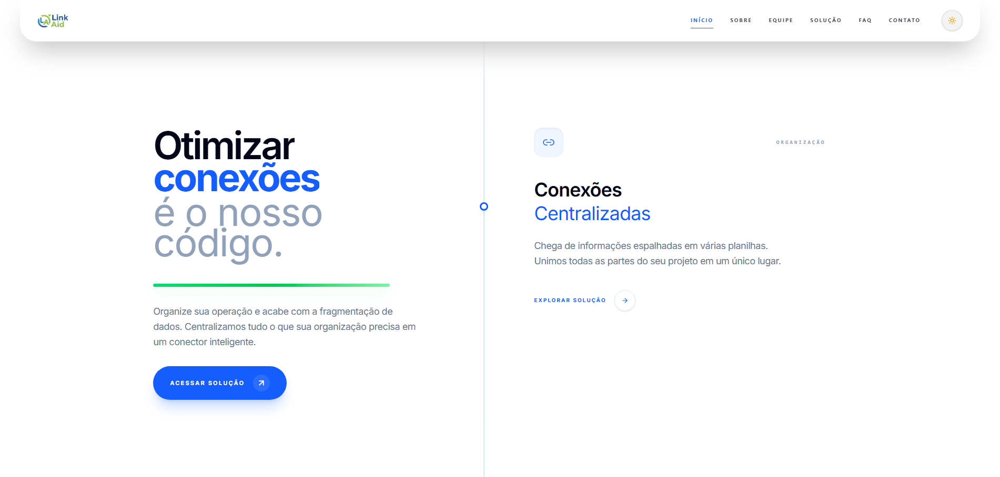

<div align="center">

# LinkAid
A vitrine digital da próxima geração em automação e centralização de contatos.

<div>
  
  
  
</div>

<br/>

🔗 **Acesse o repositório do projeto**
👉 [github.com/Calegor/LinkAid](https://github.com/Calegor/LinkAid)

🔗 **Acesse o vídeo:**
👉 [YouTube](https://youtu.be/IK4B1GOjPhk)

🔗 **Veja o site online:**
👉 [link-aid-chi.vercel.app](https://link-aid-chi.vercel.app/)

<br/>



<br/> 

<div align="left">
  
> Projeto desenvolvido durante o curso da **FIAP** para o **Challenge**.

> Este repositório contém o Front-End do site institucional e de apresentação do LinkAid. O objetivo é fornecer uma experiência de usuário impecável, rápida e totalmente responsiva para apresentar a solução LinkAid ao mercado corporativo.

---
<br/>

## 🌟 Objetivo e Problema Resolvido
### O Problema: A Fragmentação da Experiência Digital
No cenário atual, empresas e profissionais lidam com um problema comum: a comunicação está espalhada em vários lugares. São links perdidos, atendimentos feitos manualmente e tempo desperdiçado alternando entre diferentes plataformas. Essa falta de organização dificulta o contato, gera confusão e pode fazer oportunidades importantes se perderem.

O **LinkAid** surge como a solução para esse cenário. Ele é um painel inteligente que centraliza todos os pontos de contato em um único lugar. Com uma interface simples e intuitiva, o LinkAid organiza, automatiza e otimiza a comunicação, tornando o atendimento mais ágil, eficiente e profissional.

<br/>

## 🎯 Pilares da Plataforma
* **Centralização Profissional:** Um hub único para todos os seus ativos e canais de contato.
* **Performance & Escalabilidade:** Site otimizado com React para carregamento instantâneo.
* **Design Humanizado:** Interface limpa que foca na facilidade de uso, reduzindo a carga cognitiva do usuário.

<br/>

### 📐 Responsividade
O layout foi desenvolvido para funcionar perfeitamente em:

- 📱 Mobile (até 480px)  
- 📲 Tablet (até 768px)  
- 💻 Desktop (992px+)  
- 🖥️ Telas grandes (1300px+)  

<br/>

## 🚀 Stack Tecnológica
O front-end do **LinkAid** foi desenvolvido com tecnologias de ponta para garantir performance, segurança e uma experiência de usuário fluida.

| Tecnologia | Função | Descrição |
| :--- | :--- | :--- |
|  | **Framework** | Biblioteca principal para criação de interfaces baseadas em componentes reutilizáveis. |
|  | **Linguagem** | Superset de JavaScript que adiciona tipagem estática e segurança ao código. |
|  | **Estilização** | Framework utility-first para um design responsivo, moderno e de carregamento rápido. |
|  | **Build Tool** | Ferramenta de build de próxima geração para um ambiente de desenvolvimento ágil. |

<br/>

## 💻 Entregas Funcionais (Challenge)
Abaixo estão as funcionalidades centrais do Frontend:

| Categoria | Tecnologia | Status | Uso no Projeto |
| :--- | :--- | :---: | :--- |
| **Arquitetura Moderno** | **React & TypeScript** | :heavy_check_mark: | Conversão completa das páginas obrigatórias (Home, Sobre, FAQ, Contato, Equipe e Solução) para componentes funcionais com tipagem estática. |
| **Navegação SPA** | **React Router Dom** | :heavy_check_mark: | Implementação de navegação fluida sem recarregamento de página, garantindo a experiência de uma Single Page Application. |
| **Componentização** | **Modularidade React** | :heavy_check_mark: | Organização profissional em `/src/components` e `/src/pages` com componentes 100% reutilizáveis (Header, Footer, Layout, Cards). |
| **Gerenciamento de Estado** | **useState Hook** | :heavy_check_mark: | `AboutFeaturesOrbit`: Controle de interface de órbita interativa e animações.<br>`AboutTech`: Simulação de editor de código com filtros e toggle de sidebar. |
| **Efeitos e Ciclo de Vida** | **useEffect Hook** | :heavy_check_mark: | `ContactMap`: Inicialização e limpeza de animações GSAP ScrollTrigger.<br>`Navbar`: Controle de bloqueio de scroll global para o menu mobile. |
| **Rotas Dinâmicas** | **useParams** | :heavy_check_mark: | `TeamDetails`: Renderização dinâmica de perfis de membros (RM, Bio, Links) via `developers.json` através de IDs na URL. |
| **Navegação Programática**| **useNavigate** | :heavy_check_mark: | **Breadcrumb:** Implementação de botão "Voltar" inteligente baseado no histórico real do navegador (`Maps(-1)`). |
| **Comunicação** | **Props** | :heavy_check_mark: | Passagem eficiente de dados entre componentes pais e filhos, garantindo a integridade da árvore de componentes. |
| **Estilização** | **Tailwind CSS** | :heavy_check_mark: | Design profissional utility-first, eliminando CSS externo e garantindo performance superior. |
| **Responsividade Total** | **Mobile/Tablet/Desktop** | :heavy_check_mark: | Layout adaptável para todas as resoluções (480px, 768px, 992px, 1300px) utilizando as classes utilitárias do Tailwind. |
| **Formulários** | **React Hook Form** | :heavy_check_mark: | **Página de Contato:** Gestão de formulários e validações de input utilizando o hook `useForm()` para maior performance. |

<br/>

## 📂 Estrutura de Pastas

```text
link-aid/
├── public/                     # Arquivos estáticos acessíveis diretamente
├── src/
│   ├── assets/                 # Recursos de mídia do projeto
│   │   ├── icons/              # Favicon e variações de logo
│   │   └── images/             # Imagens organizadas por seção (404, contact, painel, site, team)
│   ├── components/             # Componentes React modulares e reutilizáveis
│   │   ├── About...            # Componentes específicos da página Sobre
│   │   ├── Contact...          # Componentes de formulário e mapa
│   │   ├── Faq...              # Componentes de busca e sanfona de dúvidas
│   │   ├── Home...             # Seções da página inicial (Hero, Showcase)
│   │   ├── Navbar/Footer       # Navegação global
│   │   ├── Team...             # Seções de equipe e detalhes de membros
│   │   ├── Breadcrumb...       # Navegação hierárquica e botão "Voltar"
│   │   └── ScrollToTop...      # Componente para retorno ao topo da página
│   ├── data/                   # Arquivos JSON e TS para dados e conteúdos
│   │   ├── developers.json
│   │   ├── faq.ts
│   │   ├── features.json
│   │   └── tecnologias.ts
│   ├── layout/                 # Estruturas de páginas (Default, Hero, Home)
│   ├── pages/                  # Páginas principais da aplicação (Rotas)
│   │   ├── Contato/
│   │   ├── Sobre/
│   │   ├── Equipe/
│   │   ├── Faq/
│   │   ├── Home/
│   │   ├── Mapa/
│   │   └── NotFound/
│   ├── App.tsx                 # Configuração de rotas e estrutura principal
│   ├── index.css               # Estilos globais e diretivas do Tailwind CSS
│   └── main.tsx                # Ponto de entrada da aplicação React
├── tailwind.config.js          # Configurações de design system do Tailwind
├── tsconfig.json               # Configurações de tipagem do TypeScript
├── vite.config.ts              # Configurações do ambiente de build Vite
└── README.md                   # Documentação do projeto
```

<br/>

## 🚀 Execução

Siga os passos abaixo para executar o projeto localmente:
> ⚠️ Este projeto faz parte do repositório principal do LinkAid.

<br/>

### 📥 Clonando o repositório
```bash
git clone https://github.com/Calegor/LinkAid.git
cd LinkAid
```

---

### ▶️ Frontend

```bash
cd front-end
npm install
npm run dev
```

O frontend estará disponível em:
👉 http://localhost:5173

<br/>

## 🤝 Contribuidores

<table>
  <tr>
    <td align="center">
      <a href="https://github.com/juliarichesky">
        <br>
        <sub><b>Julia Guimarães</b></sub>
      </a><br>
      RM: 568275<br>
      Turma: 1TDSPA<br><br>
      <a href="https://www.linkedin.com/in/juliarichesky/">
        
      </a>
      <a href="https://github.com/juliarichesky">
        
      </a>
    </td>
    <td align="center">
      <a href="https://github.com/juspanopoulos">
        <br>
        <sub><b>Julia Spanopoulos</b></sub>
      </a><br>
      RM: 566754<br>
      Turma: 1TDSPA<br><br>
      <a href="https://www.linkedin.com/in/juspanopoulos/">
        
      </a>
      <a href="https://github.com/juspanopoulos">
        
      </a>
    </td>
    <td align="center">
      <a href="https://github.com/thiagogramorelli">
        <br>
        <sub><b>Thiago Gramorelli</b></sub>
      </a><br>
      RM: 567630<br>
      Turma: 1TDSPA<br><br>
      <a href="https://www.linkedin.com/in/thiago-gramorelli-lima-070097185/">
        
      </a>
      <a href="https://github.com/Calegor">
        
      </a>
    </td>
  </tr>
</table>

</div>


</div>
